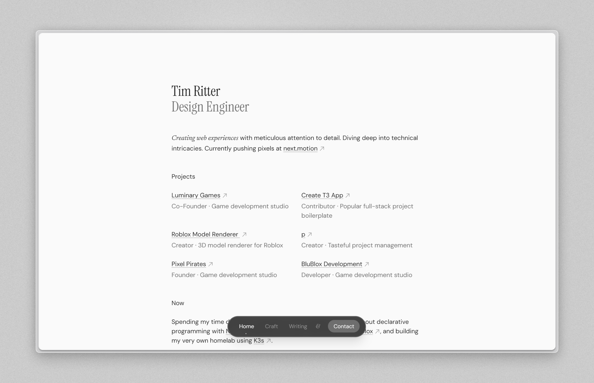

# Tim Ritter - Personal Website

<a href="https://tim-ritter.com" target="_blank">
  Live Website
</a>
 &middot; 
<a href="#overview">
  Overview
</a>
 &middot; 
<a href="#getting-started">
  Getting Started
</a>

## Overview

This repository contains the source code for my personal website. It's built using
[Next.js](https://nextjs.org/) and [Tailwind CSS](https://tailwindcss.com/).

### Features

- Responsive design
- SEO-friendly
- Light and dark mode
- Accessible (Tested with NVDA)
- Respects user preferences (color scheme, reduced motion, and constrast)

## Copying

Do whatever you want with the code. If you want to use it for your own website, feel free to do so. Just make sure to replace the content with your own.

## Getting Started

### Prerequisites

- [Git](https://git-scm.com/)
- [Bun](https://bun.sh/)

### Installation

1. Clone the repository
2. Install dependencies using `bun install`
3. Start the website using `bun dev`

You can now access the website at `http://localhost:3000`.

## Deploying to Vercel

1. Create a new repository on GitHub
2. Push your code to the new repository
3. Import the repository to Vercel

This is just a rough overview. For more information on how to deploy to Vercel, refer to the [Vercel documentation](https://vercel.com/docs/concepts/deployments/overview).