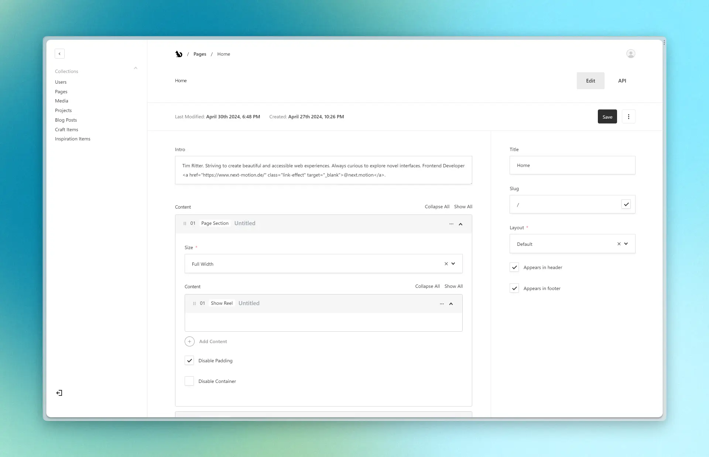

# Tim Ritter - Personal Website

[Live Website](https://tim-ritter.com) •
[Overview](#overview) •
[Getting Started](#getting-started)

# Overview

This repository contains the source code for my personal website. It is built using
[Next.js](https://nextjs.org/), [Tailwind CSS](https://tailwindcss.com/), and
[Payload CMS](https://payloadcms.com/).

## Features

- Extremely customizable thanks to [Payload CMS](https://payloadcms.com/)
- Very fast loading times thanks to aggressive caching with [Next.js Better Unstable Cache](https://github.com/vercel/next.js/tree/canary/packages/nextjs-better-unstable-cache)
- Hosted on [Vercel](https://vercel.com/) using Vercel Blob Storage and Postgres Database
- Responsive design
- SEO-friendly
- Dark and light mode

  
  <small>Payload CMS</small>

## Copying

My website is licensed under the MIT license. You may copy and use the source code for your own project, but you must include a link to this repository.

If you don't want to credit me and just need a starter template, use my [Template](./websites/template/). It's licensed under CC0. (Meaning you can use it for pretty much anything)

# Getting Started

It's important to note that this project is a [Monorepo](https://en.wikipedia.org/wiki/Monorepo) and is therefore devided into multiple [apps](./websites/) (websites) and [packages](./packages/).

## Prerequisites

- [Node.js](https://nodejs.org/en/)
- [PNPM](https://pnpm.io/)
- [Docker](https://www.docker.com/) (only when using a local PostgreSQL database)

1. Clone the repository
2. Install dependencies using `pnpm install`
3. Start the postgres database using `cd websites/www && ./scripts/start-database.sh` (requires Docker)
4. Copy the `.env.example` file to `.env` and fill in the values
5. Start the website using `pnpm dev`

You can now access the website at `http://localhost:3000`.

## Deploying to Vercel

1. Create a new repository on GitHub
2. Push your code to the new repository
3. Import the repository to Vercel
4. Configure the environment variables
5. Create a Blob Storage and Postgres Database on Vercel
6. Connect the Blob Storage and Postgres Database to the Vercel project
7. Deploy the project

This is just a rough overview. For more information on how to deploy to Vercel, refer to the [Vercel documentation](https://vercel.com/docs/concepts/deployments/overview).
